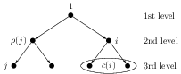

# WaveletTrees

This package contains data types I use for modelling wavelet trees.
A `WaveletTree` consists of a lowpass subband and (multiple) highpass subband(s); the highpass subband(s) are arranged in a tree structure.

For 1D signals the coefficients in the highpass subbands are arranged in a binary tree, i.e., a directed acyclic graph where each node has either zero or two children.
A binary tree with three levels are seen below.

For 2D signals the highpass subbands *within each direction* are arranged in a quad tree, i.e., a tree where each node have either zero or four children.

# Usage

The two types available are `WaveletTree1D` and `WaveletTree2D`.
A `WaveletTree1D` with `L` levels and a lowpass subband (coarsest highpass) subband with `size` coefficients are constructed with

	W = WaveletTree1D(L, size)

The returned object has

- `W.lowpass`: 
vector with lowpass coefficients.
- `W.highpass`: 
A cell of `L` vectors with coefficients from each level.

A `WaveletTree2D` with `L` levels, `D` directional subbands within each level and a lowpass subband (coarsest highpass) subband with `x-by-y` coefficients are constructed with

	WaveletTree2D(L, size; D=3)

where `size` is the tuple `(x,y)`.
The returned object has

- `W.lowpass`: 
A matrix with lowpass coefficients.
- `W.highpass`: 
A cell of `L` cells.
Each inner cell contains `D` matrices with coefficients from the directional subbands.

The type `WaveletTree` is used as an alias for the union of `WaveletTree1D` and `WaveletTree2D`. 
For `WaveletTree`s there are the functions

- `size`: Returns the number of coefficients in all subbands as either a vector or an `levels-by-2` matrix.
- `levels`: The number of levels.

For `WaveletTree2D` a `vec` function is available that vectorizes a single directional subband according to the order induced by the parents `ρ`.

# Acknowledgements

The layout with nested cells is inspired by the [contourlet toolbox](https://www.mathworks.com/matlabcentral/fileexchange/8837-contourlet-toolbox) for Matlab.

